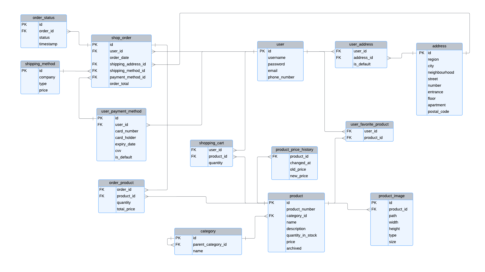

# Database for an e-commerce website

By Georgi Dimitrov

Brief description of some of the files:
* `schema.sql` – Defines the database schema, including table structures, views, indexes and triggers.
* `populate.sql` – Contains `INSERT INTO` statements used to populate the tables with initial data.
* `queries.sql` – Provides a few examples of queries that can be used to interact with the database.

## Scope

The purpose of the database is to provide entities and relationships necessary for implementing basic functionalities of an e-commerce website, such as managing and displaying products and user information as well as tracking and processing orders. The following entities fall under the database scope:

* Users, including basic identifying information
* Products, including identifying information and images
* Categories and sub-categories of products
* Relationships providing information about user's shopping cart, favorite products, addresses and payment methods
* Orders, including various identifying information as well as order tracking

Out of scope are entities and relationships tied to functionalities like product reviews, various payment methods, unique product specifications depending on (sub)category and others.

## Functional Requirements

The database supports CRUD operations necessary for:

* Managing user information, including addresses and payment methods
* Inventory management and categorization of products and quantities
* Processing and tracking of orders
* Features like user's shopping cart and favorite items

## Representation

Entities are captured in SQLite tables with the following schema.

### Entities

The database includes the following entities:

#### Users

The `user` table represents users of the website and includes:

* `id`, which specifies the unique ID for the user as an `INTEGER`. This column thus has the `PRIMARY KEY` constraint applied.
* `username`, which specifies the user's username as `TEXT`. A `UNIQUE` constraint ensures no two users have the same username.
* `password`, which specifies the user's password as `TEXT`. Following best practices means ideally this field will contain a hash of the real password of the user.
* `email`, which specifies the user's email as `TEXT`. A `UNIQUE` constraint ensures no two users have the same email.
* `phone_number`, which specifies the user's phone number as `TEXT`, because a phone number might contain leading zeros.

All columns in the `user` table are required and hence have the `NOT NULL` constraint applied.

#### Addresses

The `address` table represents delivery addresses and includes:

* `id`, which specifies the unique ID for the address as an `INTEGER`. This column thus has the `PRIMARY KEY` constraint applied.
* `region`, which specifies the region of the address as `TEXT`. This field is required thus having a `NOT NULL` constraint.
* `city`, which specifies the city of the address as TEXT. Used to store the name of the settlement, even if is not a city. This field is required thus having a `NOT NULL` constraint.
* `neighbourhood`, which specifies the neighbourhood of the address as `TEXT`.
* `street`, which specifies the street of the address as `TEXT`.
* `number`, which specifies the street number as an `INTEGER`.
* `entrance`, which specifies the entrance of the building as `TEXT`.
* `floor`, which specifies the floor of the building as an `INTEGER`.
* `apartment`, which specifies the apartment number as an `INTEGER`.
* `postal_code`, which specifies the postal code of the address as an `INTEGER`.

All columns except `region` & `city` are optional, but some of them must be present. The needed validations should be applied on the business layer of the application.

#### User addresses

The `user_address` table represents the many-to-many relationship between users and addresses and includes:

* `user_id`, which specifies the ID of the user as an `INTEGER`. This column has the `FOREIGN KEY` constraint applied, referencing the `id` column in the `user` table.
* `address_id`, which specifies the ID of the address as an `INTEGER`. This column has the `FOREIGN KEY` constraint applied, referencing the `id` column in the `address` table.
* `is_default`, which specifies whether the address is the default address for the user as an `INTEGER`. This field is required (`NOT NULL`) and must be either 0 or 1, thus having the following check constraint: `(CHECK("is_default" = 0 OR "is_default" = 1))`.

The combination of `user_id` and `address_id` serves as the `PRIMARY KEY`, ensuring that each user-address pair is unique.

#### Products

The `product` table represents products sold in the website and includes:

* `id`, which specifies the unique ID for the product as an `INTEGER`. This column has the `PRIMARY KEY` constraint applied.
* `product_number`, which specifies the unique product number as `TEXT`, because it can contain numerical, alphabetical and special characters. A `UNIQUE` constraint ensures no two products have the same product number. This field is required, thus having a `NOT NULL` constraint.
* `category_id`, which specifies the ID of the product's category as an `INTEGER`. This column has the `FOREIGN KEY` constraint applied, referencing the `id` column in the `category` table.
* `name`, which specifies the name of the product as `TEXT`. This field is required thus having a `NOT NULL` constraint.
* `description`, which specifies the description of the product as `TEXT`. This field is optional.
* `quantity_in_stock`, which specifies the quantity of the product in stock as an `INTEGER`. This field must be >= 0, thus having the following check constraint: `(CHECK("quantity_in_stock" >= 0))`.
* `price`, which specifies the price of the product as `REAL`. This field must be >= 0, thus having the following constraint: `(CHECK("price" >= 0))`.
* `archived`, which specifies if the product has been archived and is no longer offered in the website. Doing so it provides a "soft-deletion" mechanism. It is of type `INTEGER` and must be either `0` (meaning the product is currently offered in the website, even if it might not be in stock) or `1` (meaning the product has been archived), thus having the following check constraint: `CHECK("archived" = 0 OR "archived" = 1)`. This field is also required, thus having a `NOT NULL` constraint.

#### Price history of products

The `product_price_history` table represents the changes to product prices throughout time and includes:

* `product_id`, which specifies the ID of the product as an `INTEGER`. This field has a `FOREIGN KEY` constraint referencing the `id` column in the `product` table.
* `changed_at`, which specifies the timestamp when the price change occurred as `NUMERIC`. This field defaults to the current timestamp.
* `old_price`, which specifies the old price of the product as `REAL`. This field must be >= 0, thus having the following check constraint: `CHECK("old_price" >= 0)`.
* `new_price`, which specifies the new price of the product as `REAL`. This field must be >= 0, thus having the following check constraint: `CHECK("new_price" >= 0)`.

All of the columns are required, this having a `NOT NULL` constraint.

#### Categories

The `category` table represents the categories that a product might fall into and includes:

* `id`, which specifies the unique ID for the category as an `INTEGER`. This column has the `PRIMARY KEY` constraint applied.
* `parent_category_id`, which specifies the ID of the category's parent category (making the current category a sub-category) as an `INTEGER`. Categories in which the `parent_category_id` is `NULL` are considered the top-level categories. This column has the `FOREIGN KEY` constraint applied, referencing the `id` column in the same `category` table, allowing for a hierarchical structure of categories and subcategories.
* `name`, which specifies the name of the category as `TEXT`. A `UNIQUE` constraint ensures no two categories have the same name. This field is required, thus having a `NOT NULL` constraint.

#### Product images

The `product_image` table represents images used in the visualization of products and includes:

* `id`, which specifies the unique ID for the product image as an `INTEGER`. This column has the `PRIMARY KEY` constraint applied.
* `product_id`, which specifies the ID of the product associated with the image as an `INTEGER`. This column has the `FOREIGN KEY` constraint applied, referencing the `id` column in the `product` table.
* `path`, which specifies the file path of the image as `TEXT`. This columm should not contain duplicates and the field is required, thus having `UNIQUE` and `NOT NULL` constraints.
* `width`, which specifies the width of the image as an `INTEGER`.
* `height`, which specifies the height of the image as an `INTEGER`.
* `type`, which specifies the type of the image (e.g., JPEG, PNG) as `TEXT`.
* `size`, which specifies the size of the image file in bytes as an `INTEGER`.

The columns `width`, `height`, `type` and `size` columns are optional as well as `product_id` (eventually should be assigned a value).

#### Favorite products of users

The `user_favorite_product` table represents the many-to-many relationship between users and products set as favorite and includes:

* `user_id`, which specifies the ID of the user as an `INTEGER`. This column has the `FOREIGN KEY` constraint applied, referencing the `id` column in the `user` table.
* `product_id`, which specifies the ID of the product as an `INTEGER`. This column has the `FOREIGN KEY` constraint applied, referencing the `id` column in the `product` table.

The combination of `user_id` and `product_id` serves as the `PRIMARY KEY`, ensuring that each user-product pair is unique.

#### Shopping cart

The `shopping_cart` table represents the many-to-many relationship between users and producs in their shopping cart and includes:

* `user_id`, which specifies the ID of the user as an `INTEGER`. This column has the `FOREIGN KEY` constraint applied, referencing the `id` column in the `user` table.
* `product_id`, which specifies the ID of the product as an `INTEGER`. This column has the `FOREIGN KEY` constraint applied, referencing the `id` column in the `product` table.
* `quantity`, which specifies the quantity of the product in the shopping cart as an `INTEGER`. This field is required (`NOT NULL`) and must be greater than 0, thus having the following check constraint: `(CHECK("quantity" > 0))`.

The combination of `user_id` and `product_id` serves as the PRIMARY KEY, ensuring that each user-product pair in the shopping cart is unique.

#### Payment methods of users

The `user_payment_method` table represents user's payment methods (only card payment supported currently) and includes:

* `id`, which specifies the unique ID for the user payment method as an `INTEGER`. This column has the `PRIMARY KEY` constraint applied.
* `user_id`, which specifies the ID of the user associated with the payment method as an `INTEGER`. This column has the `FOREIGN KEY` constraint applied, referencing the `id` column in the `user` table.
* `card_number`, which specifies the card number as `TEXT`. This field must be unique and have exactly 16 characters long, thus having the following check constraints: `UNIQUE` and `(CHECK(LENGTH("card_number") = 16))`.
* `card_holder`, which specifies the name of the card holder as `TEXT`.
* `expiry_date`, which specifies the expiry date of the card as `NUMERIC`. This field must be a date that is later or equal to the current date, but this constraint should be ensured on the business layer of the application.
* `cvv`, which specifies the CVV code of the card as `TEXT`. This field must be exactly 3 characters long, thus having the following check constraint: `(CHECK(LENGTH("cvv") = 3))`.
* `is_default`, which specifies whether the payment method is the default one for the user as an `INTEGER`. This field must be either 0 or 1, thus having the following check constraint: `(CHECK("is_default" = 0 OR "is_default" = 1))`.

All of the columns are required, thus having a `NOT NULL` constraint.

#### Orders

The `shop_order` table represents orders made by users and includes:

* `id`, which specifies the unique ID for the order as an `INTEGER`. This column has the `PRIMARY KEY` constraint applied.
* `user_id`, which specifies the ID of the user who made the order as an `INTEGER`. This column has the `FOREIGN KEY` constraint applied, referencing the `id` column in the `user` table.
* `order_date_time`, which specifies the date and time the order was made as `NUMERIC`. This field defaults to the current timestamp `(DEFAULT CURRENT_TIMESTAMP)`.
* `shipping_address_id`, which specifies the ID of the shipping address as an `INTEGER`. This column has the `FOREIGN KEY` constraint applied, referencing the `id` column in the `address` table.
* `shipping_method_id`, which specifies the ID of the shipping method as an `INTEGER`. This column has the `FOREIGN KEY` constraint applied, referencing the `id` column in the `shipping_method` table.
* `payment_method_id`, which specifies the ID of the payment method used for the order as an `INTEGER`. This column has the `FOREIGN KEY` constraint applied, referencing the `id` column in the `user_payment_method` table.
* `order_total`, which specifies the total amount for the order as an `INTEGER`. This field defaults to 0 `(DEFAULT 0)`.

All of the columns are required, thus having a `NOT NULL` constraint.

#### Products in each order

The `order_product` table represents the product items in each order and includes:

* `order_id`, which specifies the ID of the order as an `INTEGER`. This column has the `FOREIGN KEY` constraint applied, referencing the `id` column in the `shop_order` table.
* `product_id`, which specifies the ID of the product as an `INTEGER`. This column has the `FOREIGN KEY` constraint applied, referencing the `id` column in the `product` table.
* `quantity`, which specifies the quantity of the product in the order as an `INTEGER`. This field is required (`NOT NULL`) and must be greater than 0, thus having the following check constraint: `(CHECK("quantity" > 0))`.
* `total_price`, which specifies the total price for the product (`product.price` x `quantity`) in the order as a `REAL`. This field is required (`NOT NULL`) and must be greater than 0, thus having the following check constraint: `(CHECK("total_price" > 0))`.

The combination of `order_id` and `product_id` serves as the `PRIMARY KEY`, ensuring that each order-product pair is unique.

#### Statuses of orders

The `order_status` table represents the many statuses an order may have throughout its fulfillment and includes:

* `id`, which specifies the unique ID for the order status as an `INTEGER`. This column has the `PRIMARY KEY` constraint applied.
* `order_id`, which specifies the ID of the order associated with the status as an `INTEGER`. This column has the `FOREIGN KEY` constraint applied, referencing the `id` column in the `shop_order` table.
* `status`, which specifies the status of the order as `TEXT`.
* `timestamp`, which specifies the date and time the status was recorded as `NUMERIC`. This field defaults to the current timestamp `(DEFAULT CURRENT_TIMESTAMP)`.

All of the columns are required, thus having a `NOT NULL` constraint.

#### Shipping methods

The `shipping_method` table represents the type of shipping methods that can be used to fulfill an order and includes:

* `id`, which specifies the unique ID for the shipping method as an `INTEGER`. This column has the `PRIMARY KEY` constraint applied.
* `company`, which specifies the name of the shipping company as `TEXT`.
* `type`, which specifies the type of shipping method (e.g., standard, express) as `TEXT`.
* `price`, which specifies the price of the shipping method as `REAL`. This field must be greater than or equal to 0 `(CHECK("price" >= 0))`.

All of the columns are required, thus having a `NOT NULL` constraint.

### Relationships

The below entity relationship diagram describes the relationships among the entities in the database.

As detailed by the diagram:

* A `user` can have many addresses and one of them can be set as the default one. A `user` cannot be linked to the same `address` twice. Additionally, a particular `address` can be linked to more than one `user`.
* A `product` belongs to one and only one `category`, but each `category` can have many products that fall under it.
* Categories can be hierarchical, meaning a `category` can have a parent category. This means a `category` can have multiple subcategories while having multiple parent categories.
* A `product` can have many images associated with it, but can be linked only once to each unique `image`. Additionally each `image` can be associated with only one unique `product`.
* A `user` can have many favorite products, but cannot have duplicate products as favorites. Each `product` can be set as favorite by multiple users.
* The same applies for the `shopping cart`. A `user` can have many products in their `shopping cart`. Each `product` can be added only once to the user's `shopping cart`, but each `product` can be added to the shopping carts of multiple users.
* A `user` can have many payment methods, with one of them being set as the default one. Additionally one `payment method` can be associated only with one unique `user`.
* An `order` can be associated with only one unique `user`, but a `user` can place multiple orders (but not at the same time). Additionally an `order` can be associated with only one `shipping address`, one `shipping method` and one `payment method`. Each of the mentioned can be linked to multiple different orders.
* An `order` can contain multiple products with varying quantities ordered. The same `product` cannot be added to the same `order` twice. This info is tracked with the help of the `quantity` column in the `order_product` table. Each `product` can be placed in multiple different orders (by many users) if the quantities in stock allow it.
* An `order` can have many statuses throughout it's fulfillment and each unique `order status` can be linked to only one `order`, although orders can have matching statuses.

## Optimizations

Various indexes have been created in order to optimize common queries. Those indexes are used to speed up the data retrieval from tables containing:
* user information like addresses, payment methods, shopping cart, favorite items and other.
* product information like name, description, images and other.
* order information like associated user, statuses and other.

Additionally a number of views have been created in order to simplify some queries. Those views provide information about products in stock, archived/non-archived products and successfully delivered orders.

Furthermore, two triggers have been added in order to automate the following processes:
* keeping track of product price changes throughout time
* updating product stock quantities after an order has been placed

## Limitations

The current database doesn't allow users to give reviews of purchased (or any) products. It also doesn't support payments different than debit/credit card and provides only a very simplified way of categorizing products.

Disclaimer: The database has been populated by using bulk `INSERT INTO` statements with the help of ChatGPT and because of that some of the data fields and relationships might not make much sense.
